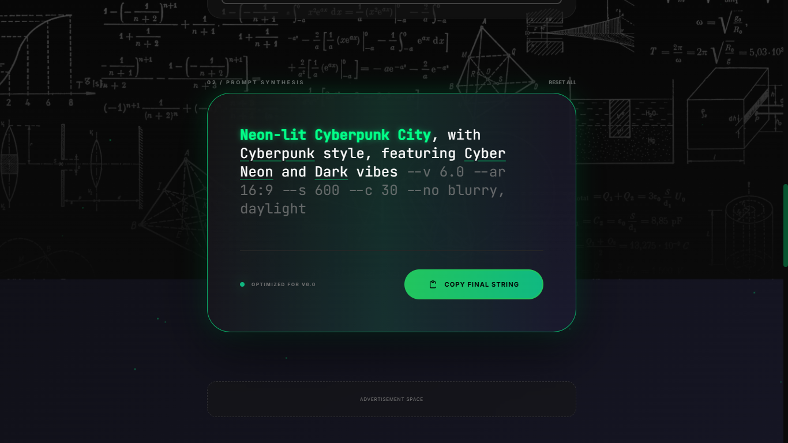
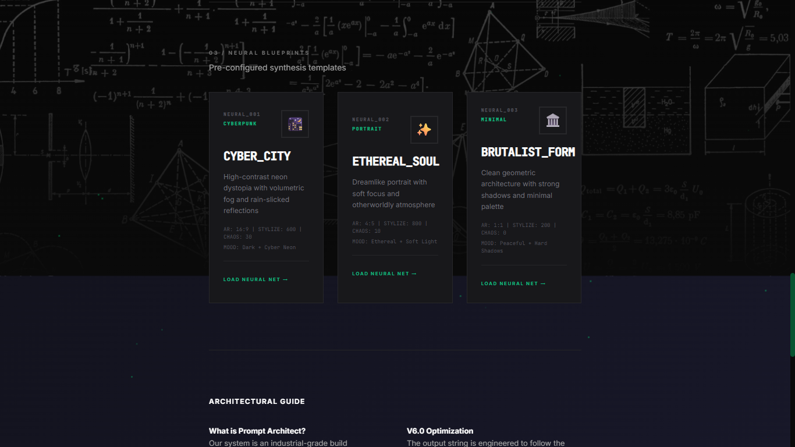
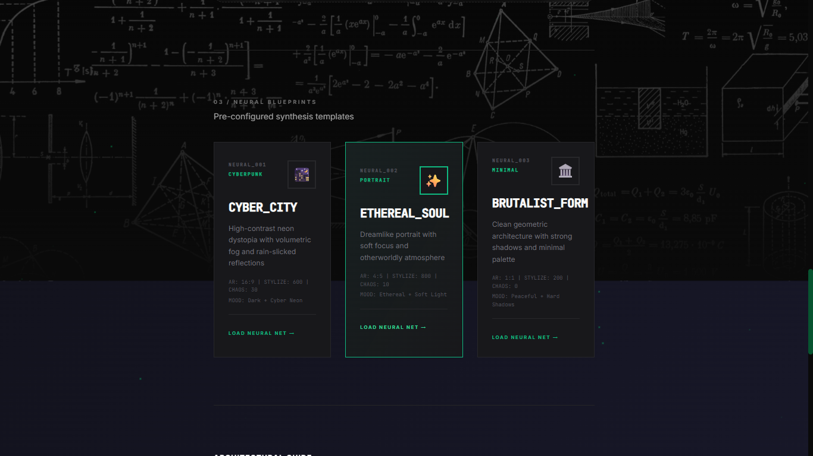
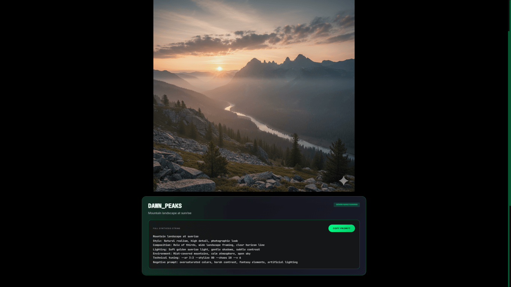

# 🏗️ Prompt Architect v6.0

**Professional AI Prompt Generator for Midjourney V6.0 & DALL-E 3**

Built with ❤️ by **Anup Baral** ([@prompts.architect](https://instagram.com/prompts.architect))

[](https://promptsarchitect.com)
[](https://developer.mozilla.org/en-US/docs/Web/HTML)
[](https://developer.mozilla.org/en-US/docs/Web/JavaScript)

---

## 👋 Hey there!

I'm **Anup**, and I built **Prompt Architect** to make creating AI art prompts way easier. If you've ever struggled with writing the perfect prompt for Midjourney or DALL-E, this tool is for you!

Instead of typing out long, complex prompts, you can just click through categories, adjust some sliders, and boom – you've got a professional-grade prompt ready to copy.

🔗 **Try it live:** [promptsarchitect.com](https://promptsarchitect.com)

### 🤖 Built with AI Assistance

**Full transparency:** I had the vision and design ideas for this project, but I used AI tools to help bring it to life. Here's how:

- **💡 Concept & Design:** 100% my ideas – I knew exactly what I wanted
- **🎨 Visual Design:** I described the industrial/cyberpunk aesthetic I envisioned, AI helped code it, then I refined it further with my feedback
- **💻 Code Implementation:** AI wrote the code based on my detailed specifications and requirements
- **✍️ Content Writing:** I outlined what to say, AI helped rewrite and polish the copy
- **🔄 Iterative Process:** Constant back-and-forth – I'd say "make this greener," "add hover effects," "change the layout," and AI would implement it

**Think of it like this:** I'm the architect (pun intended 😄), AI is the builder. I drew the blueprints, AI helped construct it, and I oversaw every detail.

**Why share this?** Because I believe in transparency. AI tools are powerful collaborators, but the creative vision, decisions, and direction are still human – that's me. This is how modern development works, and I'm not hiding it.

---

## ✨ What Makes This Cool

- **🎨 Click, Don't Type** - Select from 30+ curated attributes across 6 categories
- **⚙️ Fine-Tune Everything** - Control aspect ratio, stylization, chaos, and negative prompts
- **🧠 Quick Start Templates** - 3 pre-made "Neural Blueprints" you can use instantly
- **📋 One-Click Copy** - Animated button that copies your prompt with style
- **🖼️ Gallery Showcase** - See examples with full prompts you can copy
- **🔒 100% Private** - Everything runs in your browser, no data sent anywhere
- **📱 Works Everywhere** - Desktop, tablet, phone – all good

---

## 🎯 Who's This For?

- AI artists who want better prompts faster
- Designers prototyping visual concepts
- Content creators making consistent imagery
- Anyone learning prompt engineering
- People who just want cool AI art without the hassle

---

## 🚀 Live Demo

**Check it out:** [promptsarchitect.com](https://promptsarchitect.com)

---

## 🎨 Screenshots

### Main Prompt Builder


### Prompt Output Box


### Neural Blueprints


### Blueprint Hover Effects


### Gallery Showcase


### Full-Screen Image Viewer


---

## 🛠️ What I Built It With

**Frontend:**
- HTML5, CSS3, JavaScript (no frameworks, keeping it simple)
- Tailwind CSS for styling
- Inter & JetBrains Mono fonts

**Cool Stuff:**
- 3D rotating cube animation (CSS only!)
- Real-time prompt synthesis
- Glassmorphism effects
- Smooth animations everywhere
- Industrial/cyberpunk aesthetic

**Services:**
- Web3Forms for contact
- Google Analytics (privacy-respecting)
- Hosted on Vercel

---

## 📂 Project Structure

```
prompt-architect/
├── index.html          # Main prompt builder
├── about.html          # About page
├── gallery.html        # Image gallery
├── faq.html            # FAQ page
├── contact.html        # Contact form
├── styles.css          # All the styling
├── script.js           # All the logic
├── favicon.png         # Site icon
└── screenshots/        # README images
```

---

## 🎮 How to Use

### Basic Flow:

1. **Type your subject** (e.g., "cyberpunk city")
2. **Click attributes** from categories (Style, Mood, Lighting, etc.)
3. **Adjust parameters** (aspect ratio, stylize slider, chaos)
4. **Add negative prompt** if you want to exclude things
5. **Copy the final prompt** and paste into Midjourney/DALL-E

### Quick Start with Blueprints:

1. Scroll to "Neural Blueprints"
2. Click any card (CYBER_CITY, ETHEREAL_SOUL, or BRUTALIST_FORM)
3. Everything auto-fills – modify or use as-is
4. Copy and go!

---

## 🔧 Want to Run It Locally?

### Clone & Open:
```bash
git clone https://github.com/AnupBaral4/prompt-architect.git
cd prompt-architect
```

Then just open `index.html` in your browser. That's it! No build process, no npm, no hassle.

### Deploy Your Own:
Works on any static host:
- **Vercel** (what I use)
- **Netlify**
- **GitHub Pages**
- **Cloudflare Pages**

---

## 🎨 Design Philosophy

I wanted this to feel like a professional tool, not a toy. So I went with:

- **Dark theme** (easier on the eyes)
- **Industrial aesthetic** (sharp edges, tech-noir vibes)
- **Green accent** (that emerald color 🟢)
- **Micro-animations** (everything feels responsive)
- **No clutter** (clean, focused interface)

---

## 🔒 Privacy First

- ✅ Everything runs in your browser
- ✅ No databases, no servers storing your prompts
- ✅ No tracking (except basic Google Analytics for visitor counts)
- ✅ No login required
- ✅ No data collection

Your creative ideas stay yours.

---

## 🗺️ What's Next

### Coming Soon:
- More neural blueprint templates
- Export/import prompt collections
- Share prompts via URL
- Dark/light theme toggle

### Maybe Later:
- Stable Diffusion support
- Community blueprints
- Prompt variation generator
- Browser extension

Got ideas? Hit me up!

---

## 🤝 Contributing

Want to help make this better? Awesome!

1. Fork the repo
2. Make your changes
3. Test everything works
4. Submit a pull request

Or just open an issue if you find bugs or have suggestions.

---

## 📝 License

MIT License – feel free to use this however you want. Just keep the credit and license notice. See [LICENSE](LICENSE) for details.

**What this means:**
- ✅ Use commercially
- ✅ Modify however you want
- ✅ Share with others
- ✅ Private use

---

## 🐛 Known Issues

- Tailwind CDN warning (it's fine, just cosmetic)
- Might be slow on really old devices

Works best on:
- Chrome 90+
- Firefox 88+
- Safari 14+
- Edge 90+

---

## 💬 Get in Touch

Got questions? Want to say hi? Here's where to find me:

- **Email:** [dev.promptarchitect@gmail.com](mailto:dev.promptarchitect@gmail.com)
- **Instagram:** [@prompts.architect](https://instagram.com/prompts.architect)
- **Website:** [promptsarchitect.com](https://promptsarchitect.com)
- **GitHub:** [AnupBaral4/prompt-architect](https://github.com/AnupBaral4/prompt-architect)

---

## 🌟 Support This Project

If you find this useful:
- ⭐ Star this repo on GitHub
- 📸 Follow [@prompts.architect](https://instagram.com/prompts.architect) on Instagram
- 🔗 Share with other AI artists
- 💬 Tell people about it!

---

## 📊 Stats


---

## 🙏 Credits

**Created by:** Anup Baral

**Development Process:**
- Vision, concept, and design direction: Anup Baral
- AI-assisted code implementation and content refinement
- Iterative collaboration between human creativity and AI capabilities

**Thanks to:**
- Midjourney community for inspiration
- Everyone who gave feedback
- AI tools that helped turn ideas into reality
- You for checking this out!

**Built with:** HTML, CSS, JavaScript, AI assistance, coffee ☕, and late nights 🌙

---

<div align="center">

**Made with ❤️ by Anup Baral**

[Website](https://promptsarchitect.com) • [Instagram](https://instagram.com/prompts.architect) • [Email](mailto:dev.promptarchitect@gmail.com)

---

**© 2025 Prompt Architect**

If this helped you create something cool, I'd love to see it! Tag me on Instagram 📸

</div>